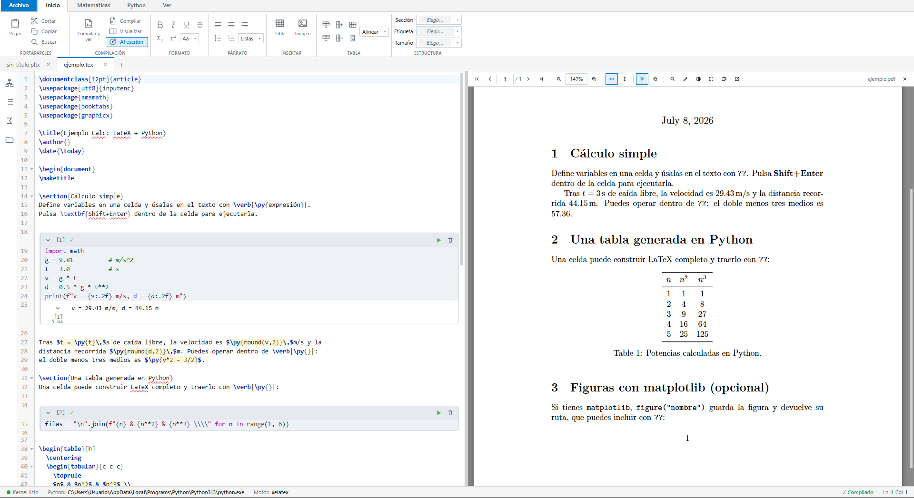
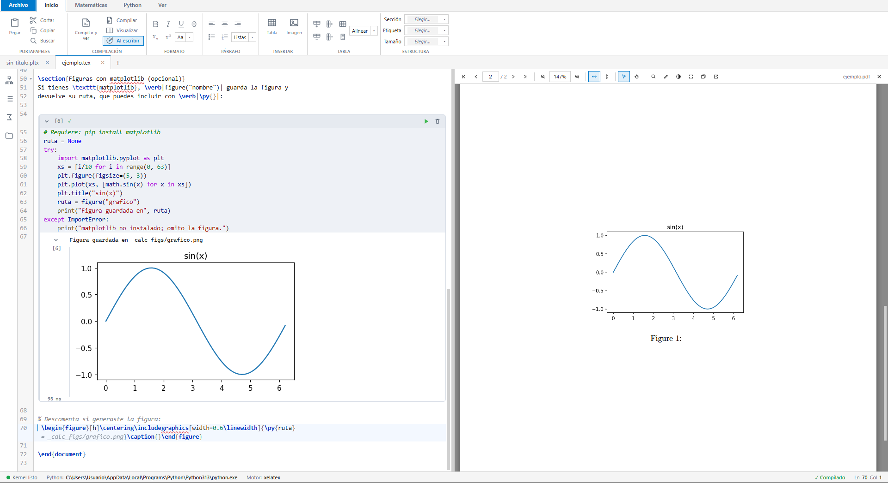

<div align="center">


# Pyx

**El cálculo y el documento, en un mismo archivo.**

Editor LaTeX con **celdas Python tipo Jupyter** integradas: escribe la memoria y calcula sin salir del documento. Cambias un dato de entrada y **todo el informe se actualiza solo**.


<br>

<a href="https://github.com/LorGIOO/Pyx/releases/latest"></a>

<br><br>



</div>

---

## ✨ ¿Por qué Pyx?

En ingeniería el **cálculo** vive en un sitio (Excel, Mathcad…) y el **informe** en otro (Word, LaTeX), y copiar valores a mano es lento y da errores. Pyx los une: el cálculo y la memoria son **el mismo objeto vivo**. Escribes Python donde lo necesitas, insertas el resultado en el texto con `\py{…}`, y al compilar obtienes un PDF con tipografía LaTeX y los números ya calculados. Cambia una carga, recompila, y **toda la memoria se recalcula sola**.

```latex
%#python
import math
D = 0.50               # diámetro (m)
A = math.pi * (D/2)**2 # área
%#end

El área de la sección es \py{round(A, 4)} m².
\pyif{A > 0.15}{\textcolor{red}{Sección sobredimensionada.}}{Dentro de lo previsto.}
```

La celda es Python normal y corriente: **importas lo que uses**, igual que en Jupyter. Los ayudantes propios de Pyx (guardar una figura, convertir un objeto a LaTeX) viven en un módulo que también se importa:

```python
from pyx import figure, figtex, tabletex, tex, texesc
```

## 🚀 Características

- **Simbiosis LaTeX ↔ Python** — celdas `%#python … %#end` (el archivo sigue siendo un `.tex` válido) y el puente **`\py{expresión}`** que mete valores calculados en el documento.
- **Texto que reacciona al cálculo** — `\pyif{condición}{…}{…}`: el informe se redacta solo según el resultado (p. ej. «CUMPLE / NO CUMPLE»).
- **Valores en vivo** — el resultado de cada `\py{}` aparece en gris junto a él mientras escribes, sin compilar (estilo Mathcad / MATLAB Live).
- **Kernel Python plano, como Jupyter** — el espacio de nombres arranca **vacío**: ninguna librería viene precargada ni tiene trato de favor, así que las actualizas, las cambias o las parcheas como en cualquier IDE. Lo que sí trae el kernel es el protocolo del cuaderno: `display()`, `get_ipython()`, las figuras de matplotlib capturadas solas y **errores estilo VSCode** (traza limpia y coloreada, línea exacta y clic para saltar).
- **handcalcs igual que en Jupyter** — `import handcalcs.render` y las magias `%%render` / `%%tex` quedan disponibles; sin ese import no existen. Se usa la librería **real** (antes se sustituía por un sucedáneo interno, y no se podía ni actualizar).
- **Los resultados viajan con el documento** — al abrir un informe ves sus números, tablas y figuras **sin ejecutar nada** (ni hace falta Python instalado). Si una celda cambió desde que se calculó, su resultado se marca **«desactualizado»** en vez de pasar por vigente: en una memoria de cálculo, un número que ya no corresponde a su fórmula es el error más caro que existe.
- **Ejecución incremental** — al recompilar solo se re-ejecuta lo que cambió; una celda de simulación larga no se repite porque hayas retocado un párrafo.
- **Interrupción sin perder la sesión** — parar una celda lanza `KeyboardInterrupt` como en Jupyter: **las variables ya calculadas siguen en memoria**.
- **Visor PDF profesional** — nítido a cualquier zoom, búsqueda, enlaces clicables, **SyncTeX** (Ctrl+clic ↔ código) y **capa de anotación/dibujo** (lápiz, resaltador, formas, notas).
- **Proyectos multi-archivo** — documento raíz con `\input`; compilar un capítulo compila todo el proyecto.
- **Tu carpeta solo tiene lo tuyo** — el motor LaTeX no escribe nada junto al documento: los `.build.tex`, el `.aux`, `.log`, `.toc`, `.out`, `.mtc*`, el índice SyncTeX y el PDF viven en un directorio de trabajo fuera del proyecto, y al guardar se empaquetan **dentro del `.pltx`** como hace un `.docx`. Lo único que se queda fuera, a propósito, son tus fuentes: `.tex`, imágenes y `.sty`.
- **Comodidades de IDE** — autocompletado y snippets, corrector ortográfico (español e inglés), plegado de código, paneles divisibles, terminal integrada (`pip install …`), atajos configurables y temas claro/oscuro/azul.
- **Funciona sin conexión** — las fórmulas de handcalcs se componen con KaTeX empaquetado en la app; nada depende de una CDN.

## 📸 Capturas

**Tablas generadas con Python.** Una celda construye el `tabular` en LaTeX y lo insertas en el documento con `\py{}`; cambia los datos y la tabla se regenera al recompilar.

<div align="center">

</div>

**Gráficos de matplotlib.** El resultado de la figura aparece **dentro de la propia celda** y, con `\includegraphics`, también en el PDF final — sin exportar nada a mano.

<div align="center">

</div>

## 📦 Instalación

Descarga el instalador de tu sistema desde la [**última release**](https://github.com/LorGIOO/Pyx/releases/latest):

| Sistema | Archivo |
|---|---|
| **Windows** (x64) | `Pyx_1.3.1_x64-setup.exe` |
| **macOS** (Intel y Apple Silicon) | `Pyx_1.3.1_universal.dmg` |
| **Linux** | `.deb` (Debian/Ubuntu) · `.rpm` (Fedora) · `.AppImage` (cualquier distro) |

Como la app aún **no está firmada**: en Windows, SmartScreen mostrará un aviso — pulsa **«Más información» → «Ejecutar de todas formas»**; en macOS, la primera vez ábrela con **clic derecho → Abrir**.

Para que las celdas y la compilación funcionen, ten instalados aparte:

- **Python 3** en el PATH — opcional: `pip install numpy matplotlib pandas sympy handcalcs`.
- Una distribución **LaTeX** con `xelatex` — [MiKTeX](https://miktex.org/) (Windows), [MacTeX](https://tug.org/mactex/) (macOS) o [TeX Live](https://tug.org/texlive/) (Linux).

## ⚙️ Compilar desde el código

```bash
npm install
npm run tauri:dev      # app de escritorio con recarga en caliente
npm run tauri:build    # genera el instalador
npm test               # pruebas de la lógica de celdas, \py{} y mapas de línea
```

Requiere **Node.js 18+**, **Rust**, **Python 3** y **LaTeX**. Solo la interfaz en el navegador: `npm run dev`.

Los instaladores de las tres plataformas los produce GitHub Actions al empujar una etiqueta `v*`: Tauri **no compila de forma cruzada**, así que cada sistema se construye en su propio runner (ver [`.github/workflows/release.yml`](.github/workflows/release.yml)).

## ⌨️ Atajos

| Atajo | Acción |
|-------|--------|
| `Mayús+Enter` | Ejecutar la celda bajo el cursor |
| `Ctrl+Alt+Enter` | Ejecutar todas las celdas |
| `Ctrl+Alt+R` | Reiniciar el kernel |
| `Ctrl+Mayús+B` | Compilar el documento |
| `Ctrl+S` · `Ctrl+N` · `Ctrl+O` | Guardar · Nuevo · Abrir |
| `Ctrl+F` | Buscar (editor o PDF, según el foco) |
| `Ctrl+T` | Comentar / descomentar |
| `Ctrl+Alt+Z` | Modo zen |

Todos reconfigurables en **Configuración → Atajos**.

## 🛠️ Stack

Tauri 2 · SolidJS · Vite · CodeMirror 6 · PDF.js · kernel Python embebido gestionado desde Rust.

## 📄 Licencia

[MIT](LICENSE) — libre para usar, modificar y distribuir. Las contribuciones son bienvenidas (ver [CONTRIBUTING.md](CONTRIBUTING.md)); abre un *issue* con ideas o problemas.
